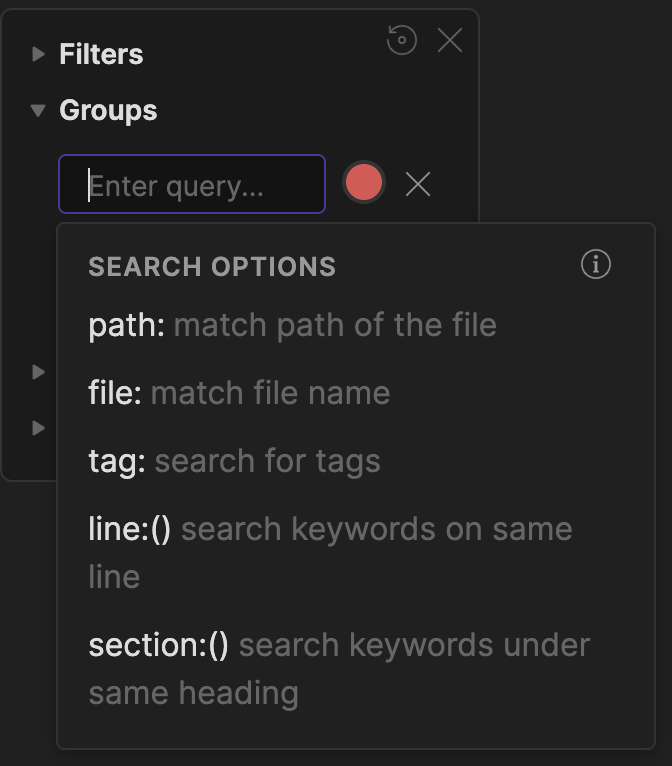
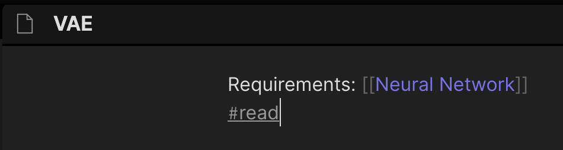
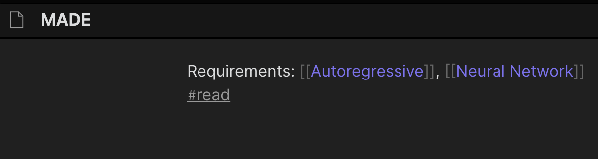
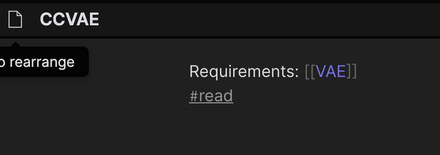
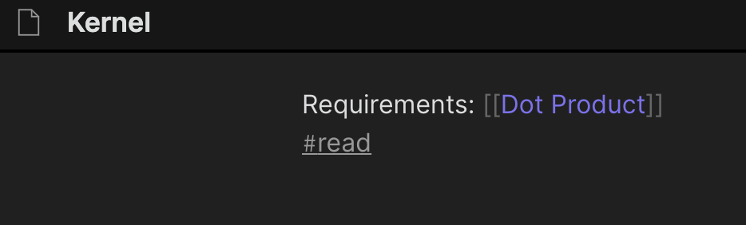
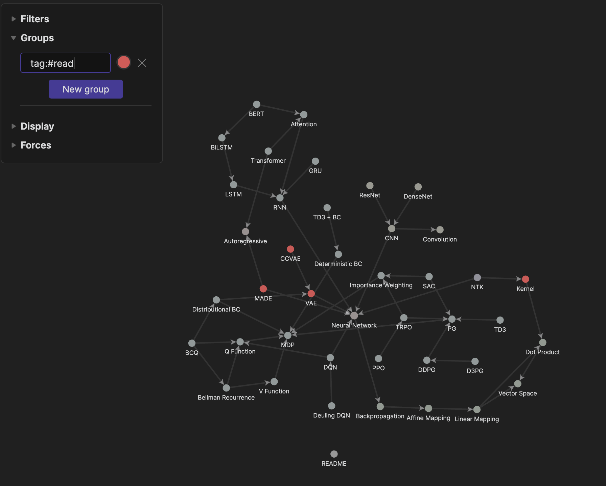

# Welcome
## If you're reading this from Github or your Markdown viewer:
Please follow the following steps to install the ML@B Research Vault. Then, read the section below the instructions in Obsidian.
1. Clone [this repository](https://github.com/mlberkeley/reading-group) to a local folder
2. Download [Obsidian](https://obsidian.ml/)
3. Open Obsidian and click the “Open” button next to “Open folder as vault” 
4. Navigate to the folder you cloned the `reading-group` repository into 
5. You should see the following Directed Acyclic Graph (DAG) in the Obsidian Graph Viewer 
6. Try filtering for parts of the DAG you're interested in
7. Try grouping the DAG
	1. Open the "Groups" drop down list to the top left of the graph viewer, press “new group,” and explore the possible criteria 
	2. Try creating a group for each base folder in the `reading-group` repo 
	3. Try adding a #read tag to a few articles and visualizing this group of articles     
8. Try adding a numbered: (1. blah \n 2. blah) or bulleted (- blah \n - blah) list, some in-text latex ($a = 1$), and some latex on its own line: $$a = 1$$ Click the preview button in the top right corner with the Cmd (mac) or Ctrl (windows) button held (or whatever the obsidian popup says) to open a preview in a separate pane. Try typing more and watch the preview update live. 
9. If you create something you'd like to be added to the master repository, create a pull request [on Github!](https://www.github.com/mlberkeley/reading-group/pulls)

## If you're reading this in Obsidian:
You're in the right place. Welcome to the ML@B Research vault! This is a folder of markdown files (see [Markdown Guide](https://www.markdownguide.org)) meant to be a central repository for ML@B research knowledge. It will be organized as an [Obsidian](https://obsidian.md/) vault, so be sure to download Obsidian if you wish to use it. This folder will be shared with all ML@B members and updated via `git`. It is intended to serve as
1. A structured, piece-by-piece educational resource for ML@B members unfamiliar with many areas of ML
2. An unstructured venue for tinkering with new ideas
3. A tool for transforming unstructured exploration into structured, absorbable knowledge

As more is decided regarding the structure of our notes, we will add to this note explaining the organization of the vault, and giving instructions to new members about how to get involved.